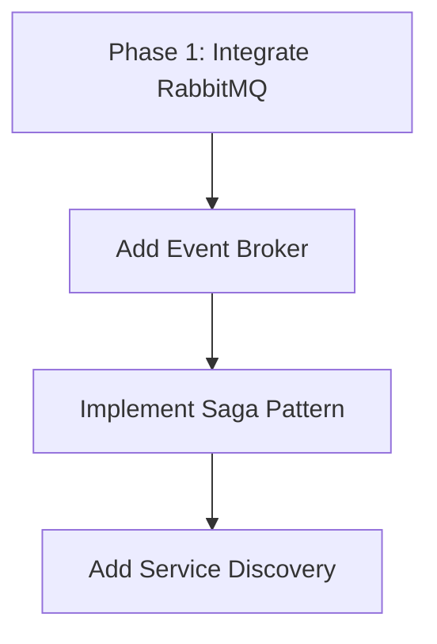

> [!NOTE]
> This document is archived context. For setup, run, and operational instructions, use INSTRUCTION_MANUAL.md.

# Architecture Review: ID-FLARE Platform
## Current State vs. PRD Alignment (March 2026)

---

## Executive Summary

The current implementation provides a **foundational microservices architecture** with core services (Auth, Inventory, Order, Logistics) and containerization infrastructure. However, it covers only **~30% of PRD requirements**. Major gaps exist in payment integration, recommendation systems, analytics, notifications, and event-driven communication. The dual-database strategy (PostgreSQL + MongoDB) and missing service-to-service communication patterns also pose scalability challenges.

---

## 1. Current System Architecture

### 1.1 Implemented Components

#### Backend Services
```
API Gateway (Port 4000) → Routes requests to:
├── Auth Service (Port 4001) - MongoDB
├── Inventory Service (Port 4002) - MongoDB  
├── Order Service (Port 4003) - MongoDB
└── Logistics Service (Port 4004) - Socket.io WebSocket
```

#### Infrastructure (Docker Compose)
- **PostgreSQL 15** - Not actively used yet
- **MongoDB 6** - Primary database (separate DB per service)
- **Redis 7** - Configured but unused
- **RabbitMQ 3** - Configured but not integrated

#### Frontend
- React 19 + Vite
- Material-UI for styling
- Context API for state (Auth, Cart)
- Axios for HTTP with JWT interceptors
- Socket.io client for real-time

#### Real-Time Communication
- Socket.io server in Logistics Service
- Basic location tracking rooms implemented

---

## 2. PRD Requirements Coverage Analysis

### 2.1 Phase 1: Refactor & Authentication ✅ PARTIAL
| Requirement | Status | Notes |
|---|---|---|
| JWT Authentication | ✅ Done | bcryptjs + jsonwebtoken configured |
| User Registration/Login | ✅ Done | Routes exist in auth-service |
| Role-Based Access | 🟡 Partial | Routes structured for roles (admin/owner/agent/customer) but enforcement missing |
| Protected Routes | ✅ Done | ProtectedRoute component in frontend |

### 2.2 Phase 2: Multi-Vendor & Order Management 🟡 PARTIAL
| Requirement | Status | Notes |
|---|---|---|
| Restaurant Browse | ✅ Done | Menu.jsx, RestaurantCard.jsx components exist |
| Menu Management | 🟡 Partial | inventoryRoutes exist, full CRUD needs verification |
| Order Placement | ✅ Done | Cart & Checkout components exist |
| Order Tracking | 🟡 Partial | Socket.io basic setup, needs order workflow integration |
| Order Status Updates | ⛔ Missing | No event propagation system |

### 2.3 Phase 3: Payment & Real-Time ⛔ NOT STARTED
| Requirement | Status | Notes |
|---|---|---|
| Payment Gateway Integration | ⛔ Missing | No Khalti/Stripe/eSewa integration |
| COD Handling | ⛔ Missing | No payment service |
| Real-Time Tracking | 🟡 Partial | Socket.io present but not fully integrated with orders |
| WebSocket Communication | ⛔ Partial | No health checks, no fallbacks |

### 2.4 Phase 4: Recommendations & Analytics ⛔ NOT STARTED
| Requirement | Status | Notes |
|---|---|---|
| Recommendation Engine | ⛔ Missing | No ML/AI service |
| Analytics Dashboard | ⛔ Missing | No analytics service |
| Business Intelligence | ⛔ Missing | No data pipeline |

### 2.5 Phase 5: Optimization & Prediction ⛔ NOT STARTED
| Requirement | Status | Notes |
|---|---|---|
| Demand Prediction (ARIMA/LSTM) | ⛔ Missing | No Python ML service |
| Route Optimization | ⛔ Missing | No algorithm service |
| Order-Batching Logic | ⛔ Missing | No optimization service |
| Delivery Assignment | ⛔ Missing | No intelligent assignment logic |

---

## 3. Critical Architectural Gaps

### 3.1 Missing Services (9/10 Required)
```
Required PRD Services          Current Status
✅ API Gateway                 Implemented
✅ Authentication Service      Implemented
✅ Order Service               Implemented
🟡 User Service                Partial (in auth-service)
⛔ Payment Service             MISSING
⛔ Delivery Service            MISSING (logistics is tracking only)
⛔ Recommendation Service      MISSING
⛔ Notification Service        MISSING
⛔ Analytics Service           MISSING
⛔ Vendor Service              MISSING (in inventory-service)
```

### 3.2 Event-Driven Architecture Issues
**Current State**: Services are isolated, no inter-service communication
**Problem**: 
- RabbitMQ configured but not integrated
- No event sourcing pattern
- Manual HTTP calls required for cross-service operations

**Example Gap**: When order status changes:
- ❌ No automatic notification to customer
- ❌ No automatic update to delivery agent
- ❌ No analytics event logging
- ❌ No inventory decrement

### 3.3 Data Management Issues
**Current Issue**: Database-per-service with NO orchestration
```
Auth Service → MongoDB (auth_db)
Inventory → MongoDB (inventory_db)  
Order → MongoDB (orders_db)
PostgreSQL → UNUSED (configured but not used)
```

**Problems**:
- Data inconsistency across services
- No distributed transactions
- No saga pattern for order workflows
- Difficult to maintain referential integrity

**Recommended**: Move to transactional events in RabbitMQ

### 3.4 Service Communication Missing
**Gap**: No integrated service-to-service communication
- No circuit breakers (Hystrix pattern)
- No service discovery (Consul/Eureka)
- No load balancing (Nginx)
- Hardcoded service URLs in gateway

### 3.5 Real-Time Gaps
**Current**: Socket.io in logistics service only
**Missing**:
- Connection pooling/clustering (Redis adapter for Socket.io)
- Fallback mechanisms (polling)
- Message persistence for offline users
- Integration with order workflow events

---

## 4. Feature Implementation Matrix

### 4.1 Customer Module
| Feature | Status | Details |
|---|---|---|
| Registration & Auth | ✅ | JWT implemented |
| Browse Restaurants | ✅ | Frontend routes ready |
| Search & Filter | 🟡 | No backend search implementation |
| Add to Cart | ✅ | Context API working |
| Place Orders | ✅ | Checkout flow exists |
| Online Payment | ⛔ | No payment gateway |
| Real-Time Tracking | 🟡 | Socket.io basic, needs integration |
| Order History | 🟡 | Routes exist, may need completion |
| Notifications | ⛔ | No notification service |

### 4.2 Vendor Module
| Feature | Status | Details |
|---|---|---|
| Registration & Approval | ⛔ | No approval workflow |
| Menu CRUD | 🟡 | Routes exist, needs full implementation |
| Order Management | 🟡 | Routes exist, needs workflow |
| Analytics Dashboard | ⛔ | Missing service |
| Revenue Tracking | ⛔ | Missing feature |

### 4.3 Delivery Agent Module
| Feature | Status | Details |
|---|---|---|
| Auth & Profile | 🟡 | Partial implementation |
| Accept/Reject Delivery | ⛔ | No assignment logic |
| Location Tracking | 🟡 | Socket.io basic setup |
| Status Updates | ⛔ | No event system |
| Earnings Tracking | ⛔ | Missing service |

### 4.4 Admin Module
| Feature | Status | Details |
|---|---|---|
| User Management | ⛔ | Routes exist, not functional |
| Vendor Management | ⛔ | Routes exist, not functional |
| Order Monitoring | ⛔ | Routes exist, not functional |
| Analytics | ⛔ | Missing service |

---

## 5. Technology Stack Alignment

### 5.1 Current vs. PRD Specifications

| Layer | PRD Requirement | Current Implementation | Gap |
|---|---|---|---|
| Frontend | React/Next.js + Tailwind | React + Material-UI | ✅ (Good) |
| Backend | Node.js/Express OR Django | Node.js/Express | ✅ (Good) |
| Database | PostgreSQL + Redis | MongoDB + PostgreSQL (unused) + Redis (unused) | 🟡 Misaligned |
| Caching | Redis | Configured but unused | ⛔ Not integrated |
| Message Broker | Kafka/RabbitMQ | RabbitMQ configured | 🟡 Not integrated |
| Real-Time | WebSockets (Socket.io) | Socket.io present | 🟡 Partial |
| Container | Docker + K8s | Docker Compose only | ⛔ No K8s manifests |
| CI/CD | Configured pipelines | Missing | ⛔ Not setup |
| Analytics | Python ML stack | Missing | ⛔ Not started |

### 5.2 Missing Technology Components
- **API Documentation**: No Swagger/OpenAPI
- **Logging**: No Winston/ELK stack
- **Monitoring**: No Prometheus/Grafana
- **Testing**: No test framework configuration
- **Messaging**: RabbitMQ not integrated
- **ML/AI**: No Python/TensorFlow/Scikit-learn
- **Service Mesh**: No Istio/Linkerd
- **Container Orchestration**: No Kubernetes setup
- **API Gateway Features**: No rate limiting, no advanced routing

---

## 6. Code Quality & Best Practices

### 6.1 Positive Aspects ✅
- Monorepo workspace structure (npm workspaces)
- Service isolation (separate directories)
- Environment variables with dotenv
- CORS handling
- JWT token integration
- Error pages routed appropriately

### 6.2 Issues & Improvements Needed 🔴

#### API Gateway
```javascript
// ❌ ISSUE: No error handling, no timeouts
app.use('/api/v1/auth', createProxyMiddleware({ target: services.auth }));

// ✅ SHOULD HAVE:
// - Error handlers
// - Request timeouts
// - Rate limiting
// - Logging
// - Health checks for services
```

#### Service Structure
```
❌ Each service connects directly to its own MongoDB
✅ SHOULD: Use PostgreSQL for transactional data + event log
```

#### Real-Time Communication
```
❌ Logistics service has Socket.io but no room management for orders
✅ SHOULD: Integrate with order events from message broker
```

---

## 7. Production Readiness Assessment

### 7.1 Readiness Score: **35/100**

| Category | Score | Notes |
|---|---|---|
| Core Services | 60% | Basic services exist but incomplete |
| Data Layer | 30% | Multiple DBs, no orchestration |
| Real-Time | 25% | Socket.io present but not integrated |
| Security | 50% | JWT configured but no rate limiting |
| Scalability | 20% | No service discovery, no load balancing |
| Testing | 5% | No test framework setup |
| Monitoring | 10% | No logging/monitoring infrastructure |
| Documentation | 15% | No API docs, no architecture docs |
| Deployment | 30% | Docker Compose only, no K8s |
| Feature Completeness | 30% | ~30% of PRD features implemented |

---

## 8. Recommended Architecture Improvements

### 8.1 Immediate (Weeks 1-2): Foundation


**Actions**:
1. Integrate RabbitMQ with order service
2. Implement order domain events (OrderCreated, OrderConfirmed, etc.)
3. Add consumer services for notifications
4. Setup service discovery with hardcoded service registry

### 8.2 Short-Term (Weeks 3-4): Critical Services
1. **Create Payment Service** (Stripe/Khalti integration)
2. **Create Notification Service** (Email/Push/In-app)
3. **Create User/Vendor Service** (Separate from Auth)
4. **Implement Order Workflow** (Saga pattern)

### 8.3 Mid-Term (Weeks 5-8): Advanced Features
1. **Analytics Service** (Real-time dashboards)
2. **Recommendation Engine** (Node.js or Python microservice)
3. **Improved Real-Time** (Socket.io with Redis adapter)
4. **Search Service** (Elasticsearch)

### 8.4 Long-Term (Weeks 9+): Optimization
1. **ML Service** (Demand prediction, route optimization)
2. **Kubernetes Deployment**
3. **Service Mesh** (Istio)
4. **Advanced Monitoring** (ELK, Prometheus)

---

## 9. Detailed Service Recommendations

### 9.1 New Service: Payment Service (Priority: CRITICAL)
```
Tech Stack: Node.js/Express
Database: PostgreSQL (transactions)
Message Broker: RabbitMQ (order payment events)
Integrations: Stripe/Khalti/eSewa
Endpoints:
  POST /api/v1/payments - Initiate payment
  GET /api/v1/payments/:orderId - Check status
  POST /api/v1/payments/verify-webhook - Handle callbacks
```

### 9.2 New Service: Notification Service (Priority: HIGH)
```
Tech Stack: Node.js/Express or Python
Message Broker: RabbitMQ (listens to events)
Integrations: Email (SendGrid), SMS (Twilio), Push (FCM)
Event Listeners:
  - order.created → Send order confirmation
  - order.shipped → Send shipping notification
  - order.delivered → Send delivery confirmation
```

### 9.3 New Service: Recommendation Service (Priority: MEDIUM)
```
Tech Stack: Python (Flask/FastAPI) + scikit-learn/TensorFlow
Algorithm: Collaborative Filtering + Content-Based
Input: User history, item metadata, time context
Endpoints:
  POST /api/v1/recommendations - Get personalized recommendations
  POST /api/v1/trending - Get trending items
  POST /api/v1/similar/:itemId - Find similar items
```

### 9.4 Enhanced Logistics Service (Priority: CRITICAL)
```
Current Issue: Basic socket location tracking only
Improvements:
  1. Integrate order workflow events from RabbitMQ
  2. Implement Redis adapter for Socket.io clustering
  3. Add delivery assignment logic (proximity + workload)
  4. Track delivery metrics (ETA, distance, status)
  5. Implement Geospatial queries with PostGIS
```

---

## 10. Database Strategy Refinement

### 10.1 Current Problem
```
Service               Database      Schema Isolation
Auth Service      → MongoDB auth_db
Inventory Service → MongoDB inventory_db
Order Service     → MongoDB orders_db
PostgreSQL        → UNUSED
```

**Problem**: No transactional consistency, data duplication risk, schema versioning issues

### 10.2 Recommended Strategy

```
┌─────────────────────────────────────────────────────┐
│             Primary Database (PostgreSQL)            │
├─────────────────────────────────────────────────────┤
│ Tables:                                              │
│  - users (auth service owns)                        │
│  - restaurants/vendors (vendor service owns)        │
│  - menu_items (inventory service owns)              │
│  - orders (order service owns)                      │
│  - order_items (order service owns)                 │
│  - deliveries (logistics service owns)              │
│  - payments (payment service owns)                  │
│  - event_log (shared event sourcing)                │
└─────────────────────────────────────────────────────┘
                          ↓
┌─────────────────────────────────────────────────────┐
│        RabbitMQ Event Stream (Event Sourcing)       │
├─────────────────────────────────────────────────────┤
│ Exchanges: order.events, payment.events,            │
│            inventory.events, user.events            │
│ Queues: Separate consumer per service               │
└─────────────────────────────────────────────────────┘
                          ↓
┌─────────────────────────────────────────────────────┐
│    Cache Layer (Redis - for read optimization)     │
├─────────────────────────────────────────────────────┤
│ - User sessions                                     │
│ - Restaurant menus (TTL-based)                      │
│ - Recommendation cache                              │
│ - Real-time order status                            │
└─────────────────────────────────────────────────────┘
```

### 10.3 Migration Path
1. Create PostgreSQL schemas for all entities
2. Migrate existing MongoDB data to PostgreSQL
3. Implement event log table
4. Setup RabbitMQ consumers
5. Decommission MongoDB per-service approach

---

## 11. Integration Patterns Needed

### 11.1 Service-to-Service Communication
**Current**: Direct HTTP (brittle)
**Needed**:
- API Gateway health checks
- Circuit breaker pattern
- Retry policies with exponential backoff
- Service discovery

### 11.2 Event-Driven Communication
**Current**: None
**Needed**:
```
Order Creation Flow:
1. User submits order → Order Service
2. Order Service emits "order.created" → RabbitMQ
3. Payment Service consumes → process payment
4. Inventory Service consumes → reserve items
5. Notification Service consumes → send confirmation
6. Analytics Service consumes → log event
```

### 11.3 Distributed Transactions (Saga Pattern)
**Current**: No transaction support across services
**Needed**:
```
Place Order Saga:
1. Create Order (PENDING)
   ├─ on success → next
   └─ on fail → rollback
2. Reserve Inventory
   ├─ on success → next
   └─ on fail → cancel order
3. Process Payment
   ├─ on success → confirm order
   └─ on fail → refund + cancel
4. Assign Delivery
5. Notify Customer
```

---

## 12. Security Enhancements Needed

| Gap | Current | Required | Priority |
|---|---|---|---|
| Rate Limiting | ❌ None | 100 requests/min per IP | CRITICAL |
| Input Validation | 🟡 Partial | Zod/Joi schemas | HIGH |
| HTTPS/TLS | ⛔ None | SSL certificates | CRITICAL |
| CORS | ✅ Enabled | Whitelist specific origins | MEDIUM |
| SQL Injection | ⛔ Potential | Use parameterized queries | CRITICAL |
| API Keys | ❌ Missing | Service-to-service auth | HIGH |
| Request Signing | ❌ Missing | HMAC signatures for webhooks | MEDIUM |
| Audit Logging | ❌ None | Log all sensitive operations | HIGH |

---

## 13. Testing & QA Gaps

| Type | Current | Needed |
|---|---|---|
| Unit Tests | None | >80% coverage |
| Integration Tests | None | API contract tests |
| E2E Tests | None | Selenium/Cypress |
| Load Tests | None | Apache JMeter/k6 |
| Security Tests | None | OWASP Top 10 checks |
| Test Automation | None | Jest/Mocha CI setup |

---

## 14. Deployment Roadmap

### Current: Docker Compose (Dev Only)
```bash
$ docker-compose up
# All services run, suitable for local development
```

### Phase 1: Docker Hub (Next 2 weeks)
```
- Push images to Docker Hub
- Create docker-compose for production
- Setup environment variable management
- Document deployment process
```

### Phase 2: Kubernetes (Weeks 5-8)
```yaml
# k8s-manifests/
├── namespace.yaml
├── auth-service/
│   ├── deployment.yaml
│   ├── service.yaml
│   └── configmap.yaml
├── order-service/
├── inventory-service/
├── logistics-service/
├── payment-service/
└── ingress.yaml
```

### Phase 3: CI/CD (Weeks 3-4)
```
GitHub Actions:
- Run tests on push
- Build Docker images
- Push to Docker Hub
- Deploy to staging
- Run E2E tests
- Manual approval for production
```

---

## 15. Monitoring & Observability

### 15.1 Missing Infrastructure
- **Logging**: No centralized logs (need ELK/Loki)
- **Metrics**: No Prometheus metrics
- **Tracing**: No distributed tracing (need Jaeger)
- **Health Checks**: Basic /health only

### 15.2 Recommended Stack
```
Application Logs  ─→ Logstash ─→ Elasticsearch ← Kibana
                                       ↑
Health Metrics ───→ Prometheus ─→ Grafana
                       ↑
Traces ────────────→ Jaeger
                       ↑
Services ←─ All emit metrics/traces/logs
```

---

## 16. Actionable Recommendations Summary

### W1-W2: Foundation (Critical Path)
- [ ] Integrate RabbitMQ with Order Service
- [ ] Implement Order Workflow Saga Pattern  
- [ ] Add event consumers (logging, notifications placeholder)
- [ ] Migrate mongoDB to PostgreSQL schema
- [ ] Add input validation (Zod/Joi) to all services
- [ ] Setup API documentation (Swagger)

### W3-W4: Core Features
- [ ] Create Payment Service + integrate Stripe
- [ ] Create Notification Service (email template)
- [ ] Implement order status event flow
- [ ] Add real-time order updates to frontend
- [ ] Setup rate limiting on API Gateway

### W5-W8: Enhancement
- [ ] Create Analytics Service
- [ ] Implement Recommendation Engine (Node/Python)
- [ ] Add Elasticsearch for search
- [ ] Improve Real-Time with Redis Adapter
- [ ] Create comprehensive test suite
- [ ] Setup Kubernetes manifests

### W9+: Production
- [ ] Deploy to Kubernetes
- [ ] Setup monitoring/logging (ELK + Prometheus)
- [ ] Database auto-scaling & backups
- [ ] Load testing & optimization
- [ ] Security hardening (WAF, API gateway policies)

---

## 17. Conclusion

The current platform has a **solid microservices foundation** but requires significant work to meet PRD specifications:

✅ **Strengths**:
- Clean service isolation
- Docker infrastructure ready
- JWT authentication
- React modern frontend
- Socket.io for real-time

⚠️ **Critical Gaps**:
- No event-driven communication (RabbitMQ unused)
- Payment service missing (CRITICAL for revenue)
- Multiple data sources with no consistency
- No notification system
- Missing advanced services (recommendations, analytics)

📋 **Next Steps**:
1. **Immediate**: Integrate RabbitMQ + implement order saga
2. **Short-term**: Build Payment + Notification services
3. **Mid-term**: Add Analytics + Recommendations
4. **Long-term**: Scale to Kubernetes + optimize

**Estimated Effort to PRD Compliance**: 8-12 weeks (depending on team size)

---

## Appendix: Current Service Details

### Service Status Summary
```
Service              Port  Status    DB        % Complete
API Gateway         4000  ✅ Running  -         60%
Auth Service        4001  ✅ Running  MongoDB   70%
Inventory Service   4002  ✅ Running  MongoDB   50%
Order Service       4003  ✅ Running  MongoDB   40%
Logistics Service   4004  ✅ Running  Memory    30%
Payment Service     -     ⛔ Missing   -         0%
Notification Service -    ⛔ Missing   -         0%
Recommendation Svc  -     ⛔ Missing   -         0%
Analytics Service   -     ⛔ Missing   -         0%
User Service        -     ⛔ Missing   -         0%
Vendor Service      -     ⛔ Missing   -         0%
```

### Environment Variables Currently Used
```
AUTH_URL (default: localhost:4001)
INVENTORY_URL (default: localhost:4002)
ORDERS_URL (default: localhost:4003)
LOGISTICS_URL (default: localhost:4004)
MONGO_URI (auth, inventory, orders services)
```

### Frontend Service Endpoints Configured
```
api.js: axios instance with JWT interceptor
authService.js: Login/Register endpoints
orderService.js: Order operations
ownerService.js: Vendor/Owner operations
restaurantService.js: Restaurant data
adminService.js: Admin operations
```
